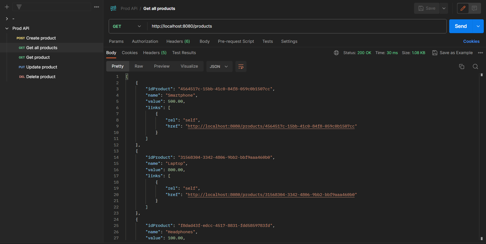

# Prod API 



O projeto Prod API se trata de uma RESTful API básica para gerenciamento de produtos. A API permite a criação, leitura, atualização e exclusão de registros de produtos, fazendo uso do banco de dados PostgreSQL para armazenamento de dados.

## O Por quê do projeto?

Este projeto foi criado com o objetivo de fornecer uma aplicação prática no conhecimento de Restful API utilizando Java com Spring Boot. 

## Observações da API

- A API segue os princípios do HATEOAS (Hypermedia as the Engine of Application State), fornecendo links relacionados para facilitar a navegação.

- Endpoints:
  - `POST /products`: Cria um novo registro de produto.
  - `GET /products`: Obtém uma lista de todos os produtos, incluindo links para detalhes individuais.
  - `GET /products/{id}`: Obtém detalhes de um produto específico, incluindo links relacionados.
  - `PUT /products/{id}`: Atualiza um produto existente com os dados fornecidos.
  - `DELETE /products/{id}`: Exclui um produto existente.

## Funcionalidades

- Criação, leitura, atualização e exclusão de registros de produtos.
- Uso de links HATEOAS para navegação e descoberta de recursos relacionados.

## Getting Started

Para executar o projeto localmente, siga as etapas abaixo:

OBS: Antes de tudo verfique se o Java SDK está instalado. Esse projeto utilizou o Java SDK 17 versão LTS.

1. **Clonar o repositório:**
   ```sh
   git clone https://github.com/gabdemello/prod-api.git   
   ```

2. **Configuração do PostgreSQL:**
   Certifique-se de ter um banco de dados PostgreSQL configurado. Atualize as configurações de conexão no arquivo `application.properties` dentro da pasta `resources`.

3. **Instalação de dependências**
  Abra o arquivo pom.xml utilizando o IntelliJ IDEA Community Edition, por exemplo. Ao fazer isso automáticamente o as dependências do projeto serão instaladas.

4. **Criação do banco de dados**
  Abra o PostgreSQL usando a ferramente pgAdmin 4 e crie um banco de dados para o projeto. Nesse projeto o banco de dados foi criado com o nome `prod`. O nome do banco de dados
  deve ser informado também dentro do arquivo `application.properties`, no campo `spring.datasource.url` após o localhost.

5. **Execute a aplicação**
  Execute a aplicação abrindo o arquivo `ProdapiApplication.java` dentro do IntelliJ IDEA Community Edition, por exemplo, e acione o Run (botão de play da IDE), lembrando que isso deve
  ser feito dentro do arquivo `ProdapiApplication.java`. 

6. **Acesse a API:**
   Acesse a API utilizando uma ferramenta de requisições como o Postman, utilizando as URLs dos endpoints descritos acima.

## Tecnologias Usadas

- Java
- Spring Boot
- Spring Validation
- PostgreSQL
- Maven

---

## Considerações

Este é um projeto de exemplo e pode ser aprimorado de várias maneiras, como autenticação, autorização, tratamento de erros mais detalhados e muito mais. Estou aberto a ideias e sugestões de melhorias.
